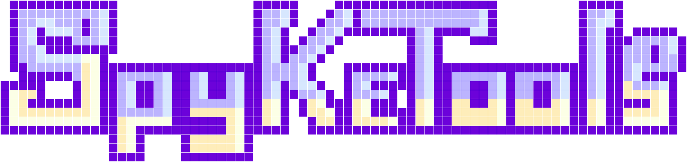

<!--<p align="center"></p>-->

<h1 align="center">SpykeTools</h1>

<h2 align="center">A high-level python toolbox for advanced large-scale neuronal data analyses</h2>
<!--<p align="center">Online article</p>-->
<!--
<p align="center">
  <a href="https://spyketools.github.io/">
    
  </a>
</p>   
-->


## Key features

+ Use of free, open-source programming language (i.e., Python).
+ Designed to efficiently cope with high-dimensional neural data and can scale to large channel counts.
+ Neurodata Without Borders (NWB) format as Input.
+ User can call high-level functions rather than scripting together many modules.
+ Focus on running parallel jobs to analyse spiking neural data.
+ Extensive functionality for extraction of high-dimensional neural patterns.


## Setup
=== "(Recomended) Conda (Linux/Windows/MacOS)"
	+ Create a conda environment:
	```sh
	conda create --name spyketools python=3.8 numpy numba
	```
	+ Activate your conda environment:
	```sh
	conda activate spyketools
	```
=== "Debian/Ubuntu"
	Open a terminal and do:
	```sh
	sudo apt-get install python-pip python-numpy python-numba python-pip
	```

## Tutorials
A series of tutorials can be visualized in `TODO` and run in google collab `TODO`:

| Module | Description | Run | View |
| - | --- | ---  | ---- |
| Data processing | Data analysis with NWB datasets | [](https://colab.research.google.com/github/bsotomayorg/SpykeTools/blob/main/docs/notebooks/01%20-%20Python_Essentials.ipynb) | [](https://nbviewer.jupyter.org/github/bsotomayorg/SpykeTools/blob/main/docs/notebooks/01%20-%20Python_Essentials.ipynb?flush_cache=true) |
| Neural Ensembles | Computation of spike train distances | [](https://colab.research.google.com/github/bsotomayorg/SpykeTools/blob/main/docs/notebooks/01%20-%20Python_Essentials.ipynb) | [](https://nbviewer.jupyter.org/github/bsotomayorg/SpykeTools/blob/main/docs/notebooks/01%20-%20Python_Essentials.ipynb?flush_cache=true) |
| Neural Ensembles | Unsupervised detection of patterns | [](https://colab.research.google.com/github/bsotomayorg/SpykeTools/blob/main/docs/notebooks/01%20-%20Python_Essentials.ipynb) | [](https://nbviewer.jupyter.org/github/bsotomayorg/SpykeTools/blob/main/docs/notebooks/01%20-%20Python_Essentials.ipynb?flush_cache=true) |
| Neural Ensembles | Measuring clustering performance | [](https://colab.research.google.com/github/bsotomayorg/SpykeTools/blob/main/docs/notebooks/01%20-%20Python_Essentials.ipynb) | [](https://nbviewer.jupyter.org/github/bsotomayorg/SpykeTools/blob/main/docs/notebooks/01%20-%20Python_Essentials.ipynb?flush_cache=true) |

---

_The work on SpykeTools was supported by the BMF (Bundesministerium fuer Bildung und Forschung), Computational Life Sciences, project BINDA (031L0167), Germany._

